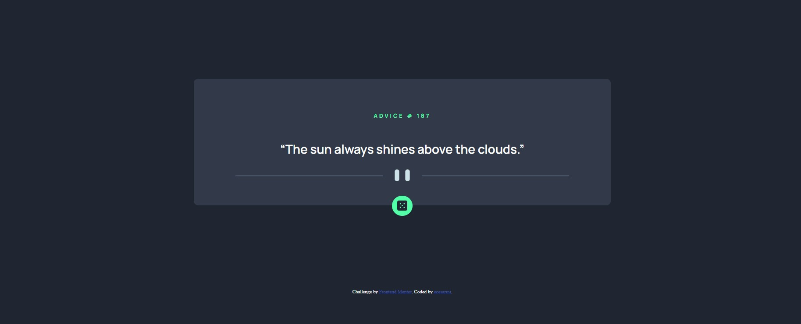

# Frontend Mentor - Advice generator app solution

This is a solution to the [Advice generator app challenge on Frontend Mentor](https://www.frontendmentor.io/challenges/advice-generator-app-QdUG-13db). Frontend Mentor challenges help you improve your coding skills by building realistic projects.

## Table of contents

- [Overview](#overview)
  - [The challenge](#the-challenge)
  - [Screenshot](#screenshot)
  - [Links](#links)
- [My process](#my-process)
  - [Built with](#built-with)
  - [What I learned](#what-i-learned)
- [Author](#author)

## Overview
Fetch data from API by JS.

### The challenge

Users should be able to:

- View the optimal layout for the app depending on their device's screen size
- See hover states for all interactive elements on the page
- Generate a new piece of advice by clicking the dice icon 

### Screenshot

### Links

- Solution URL: [Solution](https://github.com/ecesarini-frontend-mentor/advice-generator-app-main)
- Live Site URL: [Live site](https://ecesarini-frontend-mentor.github.io/advice-generator-app-main/)

## My process
- CSS: _flexbox_
- JS: _fetch_ to handle _promises_

### Built with

- Semantic HTML5 markup
- CSS custom properties
- Flexbox

### What I learned

Manage API in JS.

## Author

- Frontend Mentor - [@ecesarini](https://www.frontendmentor.io/profile/ecesarini)